# Reference App Architecture

This document provides a deep technical dive into how the PreBoot Reference App integrates all PreBoot components to create a complete SaaS application.

## System Overview

```mermaid
graph TB
    subgraph client ["🌐 Browser Client"]
        LP["🔐 Login Page<br/>• LoginForm<br/>• Registration<br/>• TenantSelect"]
        DB["📊 Dashboard<br/>• DataTable<br/>• Charts<br/>• Notifications"]
        AP["⚙️ Admin Panel<br/>• UserMgmt<br/>• TenantMgmt<br/>• Settings"]
    end
    
    subgraph gateway ["🚪 API Gateway Layer"]
        AF["🔒 Auth Filter<br/>• JWT Validate<br/>• Role Check<br/>• Rate Limit"]
        TF["🏢 Tenant Filter<br/>• Extract<br/>• Set Context<br/>• Data Scope"]
        CF["🔗 CORS Filter<br/>• Origins<br/>• Headers<br/>• Methods"]
    end
    
    subgraph business ["💼 Business Logic Layer"]
        US["👤 User Service<br/>• Registration<br/>• Authentication<br/>• Profile Mgmt"]
        DS["📋 Data Service<br/>• CRUD Ops<br/>• Validation<br/>• Business Logic"]
        ES["📡 Event Service<br/>• Publish<br/>• Subscribe<br/>• Process"]
    end
    
    subgraph data ["💾 Data Access Layer"]
        SR["🛡️ Secure Repos<br/>• Auto Filtering<br/>• Tenant Scope<br/>• Role Check"]
        QB["🔍 Query Builder<br/>• Dynamic Where<br/>• Pagination<br/>• Sorting"]
        AL["📝 Audit Logger<br/>• Change Track<br/>• User Context<br/>• Timestamps"]
    end
    
    subgraph database ["🗄️ Database Layer"]
        subgraph core ["Core Tables"]
            CT["👥 users<br/>🏢 tenants<br/>🔑 roles<br/>📋 audit_log"]
        end
        subgraph biz ["Business Tables"]
            BT["📁 projects<br/>✅ tasks<br/>📄 documents<br/>📊 reports<br/>🔒 (tenant_filtered)"]
        end
    end
    
    LP --> AF
    DB --> TF
    AP --> CF
    
    AF --> US
    TF --> DS
    CF --> ES
    
    US --> SR
    DS --> QB
    ES --> AL
    
    SR --> CT
    QB --> BT
    AL --> CT
    AL --> BT

    classDef clientLayer fill:#e3f2fd,stroke:#1976d2,stroke-width:2px
    classDef gatewayLayer fill:#f3e5f5,stroke:#7b1fa2,stroke-width:2px
    classDef businessLayer fill:#e8f5e8,stroke:#388e3c,stroke-width:2px
    classDef dataLayer fill:#fff3e0,stroke:#f57c00,stroke-width:2px
    classDef databaseLayer fill:#fce4ec,stroke:#c2185b,stroke-width:2px
    
    class LP,DB,AP clientLayer
    class AF,TF,CF gatewayLayer
    class US,DS,ES businessLayer
    class SR,QB,AL dataLayer
    class CT,BT databaseLayer
```



## Core Patterns

### 1. Multi-Tenant Data Flow

```java
@RestController
@RequestMapping("/api/projects")
public class ProjectController {
    
    @Autowired
    private ProjectService projectService;
    
    @GetMapping
    public Page<Project> getProjects(
        @TenantId String tenantId,  // Injected by PreBoot
        Pageable pageable
    ) {
        // Service automatically filters by tenantId
        return projectService.findAll(pageable);
    }
    
    @PostMapping
    public Project createProject(
        @TenantId String tenantId,
        @RequestBody CreateProjectRequest request
    ) {
        // New project automatically assigned to current tenant
        return projectService.create(request);
    }
}
```

### 2. Event-Driven Updates

```java
@Service
public class ProjectService {
    
    @EventPublisher
    private EventBus eventBus;
    
    public Project create(CreateProjectRequest request) {
        Project project = new Project(request);
        project = repository.save(project);
        
        // Event automatically includes tenant context
        eventBus.publish(new ProjectCreatedEvent(project));
        
        return project;
    }
}

@EventListener
@Component
public class ProjectNotificationHandler {
    
    @Autowired
    private WebSocketNotificationService wsService;
    
    public void handleProjectCreated(ProjectCreatedEvent event) {
        // Notification sent only to users in the same tenant
        wsService.notifyTenant(
            event.getTenantId(),
            "New project created: " + event.getProject().getName()
        );
    }
}
```

### 3. Frontend Integration

```tsx
// React component with PreBoot hooks
function ProjectList() {
  const { currentTenant } = useTenant();
  const { user, hasPermission } = useAuth();
  
  // Query automatically scoped to current tenant
  const { data: projects, loading, error } = useSecureQuery('/api/projects');
  
  // WebSocket subscription for real-time updates
  useWebSocket(`/topic/tenant/${currentTenant.id}/projects`, {
    onMessage: (notification) => {
      toast.info(notification.message);
      // Refresh project list
      refetch();
    }
  });

  if (loading) return <LoadingSpinner />;
  if (error) return <ErrorMessage error={error} />;

  return (
    <div>
      <h2>Projects for {currentTenant.name}</h2>
      <DataTable
        data={projects}
        columns={[
          { key: 'name', label: 'Name', sortable: true },
          { key: 'status', label: 'Status', filterable: true },
          { key: 'createdAt', label: 'Created', sortable: true }
        ]}
        actions={[
          {
            label: 'Edit',
            onClick: (project) => navigate(`/projects/${project.id}/edit`),
            condition: hasPermission('project:write')
          },
          {
            label: 'Delete',
            onClick: (project) => handleDelete(project.id),
            condition: hasPermission('project:delete'),
            confirm: 'Are you sure?'
          }
        ]}
      />
    </div>
  );
}
```

## Security Architecture

### Authentication Flow

1. **User Login** → JWT Token Generated
2. **Token Validation** → On every API request
3. **Role Extraction** → From JWT claims
4. **Permission Check** → Against required permissions

### Data Isolation

1. **Tenant Context** → Extracted from JWT token
2. **Query Filtering** → Automatic WHERE tenant_id = ?
3. **Insert/Update** → Automatic tenant_id assignment
4. **Cross-tenant Access** → Blocked at repository level

## Database Schema

### Core Tables

```sql
-- User management
CREATE TABLE users (
    id UUID PRIMARY KEY,
    email VARCHAR(255) UNIQUE NOT NULL,
    password_hash VARCHAR(255) NOT NULL,
    name VARCHAR(255) NOT NULL,
    status VARCHAR(50) NOT NULL,
    created_at TIMESTAMP DEFAULT NOW(),
    updated_at TIMESTAMP DEFAULT NOW()
);

-- Multi-tenancy
CREATE TABLE tenants (
    id UUID PRIMARY KEY,
    name VARCHAR(255) NOT NULL,
    slug VARCHAR(100) UNIQUE NOT NULL,
    status VARCHAR(50) NOT NULL,
    plan VARCHAR(50) NOT NULL,
    created_at TIMESTAMP DEFAULT NOW()
);

-- User-Tenant relationships
CREATE TABLE user_tenants (
    id UUID PRIMARY KEY,
    user_id UUID REFERENCES users(id),
    tenant_id UUID REFERENCES tenants(id),
    role VARCHAR(100) NOT NULL,
    status VARCHAR(50) NOT NULL,
    joined_at TIMESTAMP DEFAULT NOW(),
    UNIQUE(user_id, tenant_id)
);

-- Audit logging
CREATE TABLE audit_log (
    id UUID PRIMARY KEY,
    tenant_id UUID REFERENCES tenants(id),
    user_id UUID REFERENCES users(id),
    entity_type VARCHAR(100) NOT NULL,
    entity_id VARCHAR(255) NOT NULL,
    action VARCHAR(50) NOT NULL,
    old_data JSONB,
    new_data JSONB,
    timestamp TIMESTAMP DEFAULT NOW()
);
```

### Business Tables (Example)

```sql
-- Tenant-scoped business data
CREATE TABLE projects (
    id UUID PRIMARY KEY,
    tenant_id UUID REFERENCES tenants(id) NOT NULL,
    name VARCHAR(255) NOT NULL,
    description TEXT,
    status VARCHAR(50) NOT NULL,
    owner_id UUID REFERENCES users(id),
    created_at TIMESTAMP DEFAULT NOW(),
    updated_at TIMESTAMP DEFAULT NOW()
);

-- Automatic tenant filtering index
CREATE INDEX idx_projects_tenant_id ON projects(tenant_id);

-- Row-level security (optional additional layer)
ALTER TABLE projects ENABLE ROW LEVEL SECURITY;
CREATE POLICY tenant_isolation ON projects
    USING (tenant_id = current_setting('app.current_tenant_id')::UUID);
```

## Performance Considerations

### Database Optimization

- **Connection Pooling**: HikariCP with tenant-aware routing
- **Query Optimization**: Automatic tenant_id indexing
- **Caching**: Redis for session management and frequent queries
- **Read Replicas**: For reporting and analytics

### Frontend Optimization

- **Code Splitting**: Lazy loading for different modules
- **Data Caching**: React Query for API responses
- **Virtual Scrolling**: For large data tables
- **WebSocket Batching**: Aggregate notifications

### Monitoring & Observability

- **Application Metrics**: Micrometer + Prometheus
- **Performance Tracking**: @WarnOnSlowCall annotations
- **Error Tracking**: Centralized logging with tenant context
- **Business Metrics**: Custom dashboards per tenant

## Deployment Architecture

### Production Setup

```yaml
# docker-compose.yml
version: '3.8'
services:
  app:
    image: preboot-refapp:latest
    environment:
      - SPRING_PROFILES_ACTIVE=prod
      - DATABASE_URL=jdbc:postgresql://db:5432/preboot
    depends_on:
      - db
      - redis
    
  db:
    image: postgres:15
    environment:
      - POSTGRES_DB=preboot
      - POSTGRES_USER=preboot
      - POSTGRES_PASSWORD=${DB_PASSWORD}
    volumes:
      - postgres_data:/var/lib/postgresql/data
  
  redis:
    image: redis:7-alpine
    volumes:
      - redis_data:/data
  
  nginx:
    image: nginx:alpine
    ports:
      - "80:80"
      - "443:443"
    volumes:
      - ./nginx.conf:/etc/nginx/nginx.conf
      - ./ssl:/etc/ssl
```

### Kubernetes Deployment

- **StatefulSets** for database
- **Deployments** for application services  
- **Services** for load balancing
- **Ingress** for SSL termination
- **ConfigMaps** for configuration
- **Secrets** for sensitive data

This architecture demonstrates how PreBoot components work together to create a scalable, secure, multi-tenant SaaS application while maintaining clean separation of concerns and following enterprise patterns.