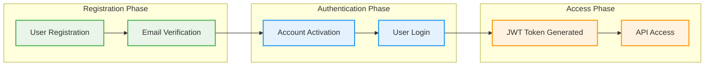

# Authentication Flow

This document walks through the complete authentication flow in the PreBoot Reference App, from user registration to secure API access.

## Flow Overview



## 1. User Registration

### Frontend: Registration Form

```tsx
// components/auth/RegistrationForm.tsx
import { useAuth } from '@preboot/ui';

function RegistrationForm() {
  const { register, loading, error } = useAuth();
  
  const handleSubmit = async (formData) => {
    try {
      await register({
        name: formData.name,
        email: formData.email,
        password: formData.password,
        tenantName: formData.companyName, // Creates new tenant
        acceptTerms: formData.acceptTerms
      });
      
      // Show success message
      toast.success('Registration successful! Check your email to activate your account.');
    } catch (err) {
      console.error('Registration failed:', err);
    }
  };

  return (
    <form onSubmit={handleSubmit}>
      <input name="name" placeholder="Full Name" required />
      <input name="email" type="email" placeholder="Email" required />
      <input name="password" type="password" placeholder="Password" required />
      <input name="companyName" placeholder="Company Name" required />
      <label>
        <input name="acceptTerms" type="checkbox" required />
        I accept the Terms of Service
      </label>
      <button type="submit" disabled={loading}>
        {loading ? 'Creating Account...' : 'Sign Up'}
      </button>
      {error && <div className="error">{error.message}</div>}
    </form>
  );
}
```

### Backend: Registration Processing

```java
// controller/AuthController.java
@RestController
@RequestMapping("/api/auth")
public class AuthController {
    
    @Autowired
    private UserRegistrationService registrationService;
    
    @PostMapping("/register")
    public ResponseEntity<RegistrationResponse> register(
            @RequestBody @Valid RegistrationRequest request) {
        
        try {
            RegistrationResult result = registrationService.registerUser(request);
            
            return ResponseEntity.ok(RegistrationResponse.builder()
                .userId(result.getUser().getId())
                .tenantId(result.getTenant().getId())
                .message("Registration successful. Please check your email for activation.")
                .build());
                
        } catch (UserAlreadyExistsException e) {
            return ResponseEntity.badRequest()
                .body(RegistrationResponse.error("User already exists"));
        }
    }
}

// service/UserRegistrationService.java
@Service
@Transactional
public class UserRegistrationService {
    
    @Autowired
    private UserRepository userRepository;
    
    @Autowired
    private TenantService tenantService;
    
    @Autowired
    private EmailService emailService;
    
    @EventPublisher
    private EventBus eventBus;
    
    public RegistrationResult registerUser(RegistrationRequest request) {
        // 1. Create tenant first
        Tenant tenant = tenantService.createTenant(
            request.getTenantName(),
            request.getEmail() // Owner email
        );
        
        // 2. Create user
        User user = User.builder()
            .email(request.getEmail())
            .name(request.getName())
            .passwordHash(passwordEncoder.encode(request.getPassword()))
            .status(UserStatus.PENDING_ACTIVATION)
            .build();
        
        user = userRepository.save(user);
        
        // 3. Assign user to tenant as ADMIN
        tenantService.addUserToTenant(user.getId(), tenant.getId(), Role.ADMIN);
        
        // 4. Generate activation token
        String activationToken = tokenService.generateActivationToken(user);
        
        // 5. Send activation email
        emailService.sendActivationEmail(user.getEmail(), activationToken);
        
        // 6. Publish registration event
        eventBus.publish(new UserRegisteredEvent(user, tenant));
        
        return RegistrationResult.builder()
            .user(user)
            .tenant(tenant)
            .build();
    }
}
```

## 2. Email Verification

### Email Template

```html
<!-- templates/activation-email.html -->
<!DOCTYPE html>
<html>
<head>
    <title>Activate Your PreBoot Account</title>
</head>
<body>
    <h1>Welcome to PreBoot!</h1>
    <p>Hi {{userName}},</p>
    
    <p>Thank you for registering with PreBoot. To complete your registration, 
       please click the button below to activate your account:</p>
    
    <a href="{{activationUrl}}" 
       style="background-color: #1976d2; color: white; padding: 12px 24px; 
              text-decoration: none; border-radius: 4px; display: inline-block;">
        Activate Account
    </a>
    
    <p>This link will expire in 24 hours.</p>
    
    <p>If you didn't create an account with us, please ignore this email.</p>
    
    <p>Best regards,<br>The PreBoot Team</p>
</body>
</html>
```

### Activation Processing

```java
// controller/AuthController.java
@GetMapping("/activate")
public ResponseEntity<String> activateAccount(@RequestParam String token) {
    try {
        ActivationResult result = userService.activateUser(token);
        
        // Redirect to frontend with success message
        return ResponseEntity.status(HttpStatus.FOUND)
            .location(URI.create("/login?activated=true"))
            .build();
            
    } catch (InvalidTokenException | TokenExpiredException e) {
        return ResponseEntity.status(HttpStatus.FOUND)
            .location(URI.create("/login?error=activation_failed"))
            .build();
    }
}

// service/UserService.java
@Transactional
public ActivationResult activateUser(String token) {
    // 1. Validate token
    TokenValidationResult validation = tokenService.validateActivationToken(token);
    if (!validation.isValid()) {
        throw new InvalidTokenException("Invalid activation token");
    }
    
    // 2. Get user
    User user = userRepository.findById(validation.getUserId())
        .orElseThrow(() -> new UserNotFoundException("User not found"));
    
    // 3. Check if already activated
    if (user.getStatus() == UserStatus.ACTIVE) {
        throw new UserAlreadyActivatedException("User already activated");
    }
    
    // 4. Activate user
    user.setStatus(UserStatus.ACTIVE);
    user.setActivatedAt(Instant.now());
    user = userRepository.save(user);
    
    // 5. Publish activation event
    eventBus.publish(new UserActivatedEvent(user));
    
    return ActivationResult.success(user);
}
```

## 3. Login Process

### Frontend: Login Form

```tsx
// components/auth/LoginForm.tsx
import { useAuth } from '@preboot/ui';

function LoginForm() {
  const { login, loading, error } = useAuth();
  const navigate = useNavigate();
  
  const handleSubmit = async (formData) => {
    try {
      await login({
        email: formData.email,
        password: formData.password,
        rememberMe: formData.rememberMe
      });
      
      // Redirect to dashboard
      navigate('/dashboard');
    } catch (err) {
      // Error handling is managed by useAuth hook
      console.error('Login failed:', err);
    }
  };

  return (
    <form onSubmit={handleSubmit}>
      <input name="email" type="email" placeholder="Email" required />
      <input name="password" type="password" placeholder="Password" required />
      <label>
        <input name="rememberMe" type="checkbox" />
        Remember me
      </label>
      <button type="submit" disabled={loading}>
        {loading ? 'Signing In...' : 'Sign In'}
      </button>
      {error && <div className="error">{error.message}</div>}
      <a href="/forgot-password">Forgot your password?</a>
    </form>
  );
}
```

### Backend: Authentication

```java
// controller/AuthController.java
@PostMapping("/login")
public ResponseEntity<LoginResponse> login(@RequestBody @Valid LoginRequest request) {
    try {
        AuthenticationResult result = authService.authenticate(request);
        
        return ResponseEntity.ok(LoginResponse.builder()
            .accessToken(result.getAccessToken())
            .refreshToken(result.getRefreshToken())
            .user(result.getUser())
            .tenants(result.getAvailableTenants())
            .expiresIn(result.getExpiresIn())
            .build());
            
    } catch (BadCredentialsException e) {
        return ResponseEntity.status(HttpStatus.UNAUTHORIZED)
            .body(LoginResponse.error("Invalid email or password"));
    } catch (AccountNotActivatedException e) {
        return ResponseEntity.status(HttpStatus.FORBIDDEN)
            .body(LoginResponse.error("Account not activated. Please check your email."));
    }
}

// service/AuthService.java
@Service
public class AuthService {
    
    @Autowired
    private UserRepository userRepository;
    
    @Autowired
    private PasswordEncoder passwordEncoder;
    
    @Autowired
    private JwtTokenService tokenService;
    
    public AuthenticationResult authenticate(LoginRequest request) {
        // 1. Find user
        User user = userRepository.findByEmail(request.getEmail())
            .orElseThrow(() -> new BadCredentialsException("Invalid credentials"));
        
        // 2. Validate password
        if (!passwordEncoder.matches(request.getPassword(), user.getPasswordHash())) {
            throw new BadCredentialsException("Invalid credentials");
        }
        
        // 3. Check account status
        if (user.getStatus() != UserStatus.ACTIVE) {
            throw new AccountNotActivatedException("Account not activated");
        }
        
        // 4. Get user's tenants
        List<UserTenant> userTenants = tenantService.getUserTenants(user.getId());
        if (userTenants.isEmpty()) {
            throw new NoTenantsException("User has no active tenants");
        }
        
        // 5. Set default tenant (first one or last used)
        UserTenant defaultTenant = getDefaultTenant(userTenants);
        
        // 6. Generate tokens
        String accessToken = tokenService.generateAccessToken(user, defaultTenant);
        String refreshToken = tokenService.generateRefreshToken(user);
        
        // 7. Update last login
        user.setLastLoginAt(Instant.now());
        userRepository.save(user);
        
        // 8. Publish login event
        eventBus.publish(new UserLoggedInEvent(user, defaultTenant.getTenant()));
        
        return AuthenticationResult.builder()
            .user(user)
            .accessToken(accessToken)
            .refreshToken(refreshToken)
            .availableTenants(userTenants)
            .expiresIn(tokenService.getAccessTokenExpiration())
            .build();
    }
}
```

## 4. JWT Token Structure

### Token Claims

```json
{
  "sub": "user-uuid-here",
  "email": "user@example.com",
  "name": "John Doe",
  "tenant_id": "tenant-uuid-here",
  "tenant_name": "ACME Corp",
  "role": "ADMIN",
  "permissions": ["user:read", "user:write", "project:read", "project:write"],
  "iat": 1640995200,
  "exp": 1641081600
}
```

### Token Validation Filter

```java
// security/JwtAuthenticationFilter.java
@Component
public class JwtAuthenticationFilter extends OncePerRequestFilter {
    
    @Autowired
    private JwtTokenService tokenService;
    
    @Override
    protected void doFilterInternal(HttpServletRequest request, 
                                  HttpServletResponse response, 
                                  FilterChain filterChain) throws ServletException, IOException {
        
        String token = extractToken(request);
        if (token != null) {
            try {
                // 1. Validate token
                TokenValidationResult validation = tokenService.validateToken(token);
                
                if (validation.isValid()) {
                    // 2. Create authentication
                    PrebootAuthentication auth = new PrebootAuthentication(
                        validation.getUser(),
                        validation.getTenant(),
                        validation.getPermissions()
                    );
                    
                    // 3. Set security context
                    SecurityContextHolder.getContext().setAuthentication(auth);
                    
                    // 4. Set tenant context for data access
                    TenantContext.setCurrentTenant(validation.getTenant());
                }
                
            } catch (TokenValidationException e) {
                // Token invalid - continue without authentication
                logger.debug("Token validation failed: {}", e.getMessage());
            }
        }
        
        filterChain.doFilter(request, response);
        
        // Clear tenant context after request
        TenantContext.clear();
    }
    
    private String extractToken(HttpServletRequest request) {
        String bearerToken = request.getHeader("Authorization");
        if (bearerToken != null && bearerToken.startsWith("Bearer ")) {
            return bearerToken.substring(7);
        }
        return null;
    }
}
```

## 5. API Security

### Endpoint Protection

```java
// controller/ProjectController.java
@RestController
@RequestMapping("/api/projects")
@PreAuthorize("hasPermission('project', 'read')")
public class ProjectController {
    
    @GetMapping
    public Page<Project> getProjects(
            @AuthenticationPrincipal PrebootUser user,
            @TenantId String tenantId,
            Pageable pageable) {
        // User and tenant automatically injected
        return projectService.findAll(pageable);
    }
    
    @PostMapping
    @PreAuthorize("hasPermission('project', 'write')")
    public Project createProject(
            @AuthenticationPrincipal PrebootUser user,
            @TenantId String tenantId,
            @RequestBody @Valid CreateProjectRequest request) {
        return projectService.create(request);
    }
}
```

### Frontend: Authenticated Requests

```tsx
// hooks/useSecureQuery.ts
import { useAuth } from '@preboot/ui';

export function useSecureQuery(endpoint: string, options = {}) {
  const { token, logout } = useAuth();
  
  return useQuery(endpoint, async () => {
    const response = await fetch(`/api${endpoint}`, {
      headers: {
        'Authorization': `Bearer ${token}`,
        'Content-Type': 'application/json',
        ...options.headers
      },
      ...options
    });
    
    if (response.status === 401) {
      // Token expired or invalid
      logout();
      throw new Error('Authentication expired');
    }
    
    if (!response.ok) {
      throw new Error(`API Error: ${response.status}`);
    }
    
    return response.json();
  });
}
```

## 6. Session Management

### Token Refresh

```java
// controller/AuthController.java
@PostMapping("/refresh")
public ResponseEntity<RefreshResponse> refreshToken(@RequestBody RefreshRequest request) {
    try {
        RefreshResult result = authService.refreshToken(request.getRefreshToken());
        
        return ResponseEntity.ok(RefreshResponse.builder()
            .accessToken(result.getNewAccessToken())
            .expiresIn(result.getExpiresIn())
            .build());
            
    } catch (InvalidTokenException e) {
        return ResponseEntity.status(HttpStatus.UNAUTHORIZED)
            .body(RefreshResponse.error("Invalid refresh token"));
    }
}
```

### Frontend: Auto Token Refresh

```tsx
// hooks/useTokenRefresh.ts
import { useAuth } from '@preboot/ui';

export function useTokenRefresh() {
  const { token, refreshToken, logout } = useAuth();
  
  useEffect(() => {
    if (!token) return;
    
    const tokenData = parseJWT(token);
    const expiresIn = tokenData.exp * 1000 - Date.now();
    
    // Refresh 5 minutes before expiration
    const refreshTime = expiresIn - (5 * 60 * 1000);
    
    if (refreshTime > 0) {
      const timeoutId = setTimeout(async () => {
        try {
          await refreshToken();
        } catch (err) {
          console.error('Token refresh failed:', err);
          logout();
        }
      }, refreshTime);
      
      return () => clearTimeout(timeoutId);
    }
  }, [token, refreshToken, logout]);
}
```

This complete authentication flow demonstrates how PreBoot handles secure user registration, email verification, login, and ongoing session management in a multi-tenant environment.